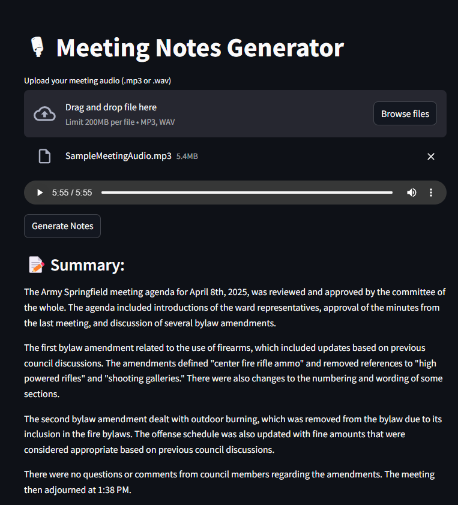
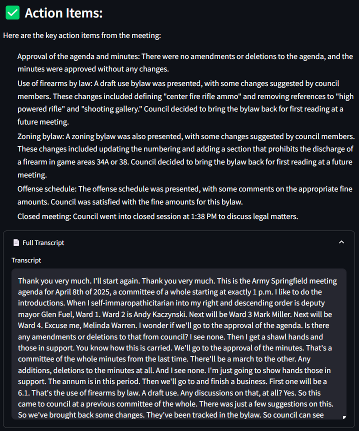

# MeetingNotesGenerator

A simple web application that takes an audio recording of a meeting, transcribes it, and generates a summary and list of action items using local AI models.

## Why?

Quickly process meeting audio files (.mp3, .wav) to get key takeaways without relying on external cloud services.

## Technologies Used

*   **Backend:** [FastAPI](https://fastapi.tiangolo.com/) (Python web framework)
*   **Frontend:** [Streamlit](https://streamlit.io/) (Python UI library)
*   **Transcription:** [OpenAI Whisper](https://github.com/openai/whisper) (via `openai-whisper` package)
*   **Summarization & Action Items:** [Ollama](https://ollama.com/) running the [Llama 2](https://ollama.com/library/llama2) model locally.
*   **Language:** Python 3

## Setup and Usage

1.  **Prerequisites:**
    *   **Python:** Ensure you have Python 3.8+ installed.
    *   **FFmpeg:** Whisper requires FFmpeg. Install it on your system. On Windows, you can use Chocolatey: `choco install ffmpeg`. On macOS: `brew install ffmpeg`. On Linux: `sudo apt update && sudo apt install ffmpeg` or use your distribution's package manager. Verify with `ffmpeg -version`.
    *   **Rust:** Some Whisper dependencies may require the Rust compiler. Install it from [https://rustup.rs/](https://rustup.rs/). Verify with `rustc --version`.
    *   **Ollama:** Download and install Ollama from [https://ollama.com/](https://ollama.com/).
    *   **Llama 2 Model:** Pull the Llama 2 model for Ollama by running: `ollama run llama2`. (Note: This needs to be running in the background for the app to work).

2.  **Clone the Repository:**
    ```bash
    git clone https://github.com/ashish-kj/MeetingNotesGenerator.git
    cd MeetingNotesGenerator
    ```

3.  **Create and Activate Virtual Environment:**
    ```bash
    # Create the environment
    python -m venv venv

    # Activate (Windows - PowerShell/CMD)
    .\venv\Scripts\activate

    # Activate (Linux/macOS - Bash/Zsh)
    # source venv/bin/activate
    ```

4.  **Install Dependencies:**
    ```bash
    # Ensure pip, setuptools, and wheel are up-to-date
    python -m pip install --upgrade pip setuptools wheel

    # Install project requirements
    pip install -r requirements.txt
    ```
    *If you encounter issues installing `openai-whisper`, try installing it directly from GitHub after ensuring FFmpeg and Rust are installed:*
    ```bash
    # pip install git+https://github.com/openai/whisper.git
    # pip install -r requirements.txt # Install remaining dependencies
    ```


5.  **Run Ollama:**
    Make sure the Ollama application is running and has the `llama2` model available. You might need to start it manually or ensure the background service is active.

6.  **Run the Backend (FastAPI):**
    Open a terminal, navigate to the project root (`MeetingNotesGenerator`), ensure your virtual environment is activated, and run:
    ```bash
    uvicorn backend.main:app --reload --port 8000
    ```
    The backend API will be available at `http://localhost:8000`.

7.  **Run the Frontend (Streamlit):**
    Open a *second* terminal, navigate to the project root, ensure your virtual environment is activated, and run:
    ```bash
    streamlit run frontend/app.py
    ```
    Streamlit will open the application in your web browser, usually at `http://localhost:8501`.

8.  **Use the App:**
    *   Upload an MP3 or WAV audio file using the file uploader in the web interface.
    *   Click "Generate Notes".
    *   Wait for the processing (transcription and LLM calls) to complete.
    *   View the summary, action items, and full transcript.

## Demo

A sample audio file (`SampleMeetingAudio.mp3`) is available in the `Resources` folder for testing.

Screenshots of the running application is here as well

 


